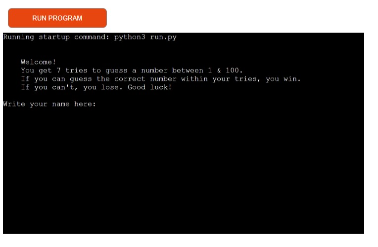
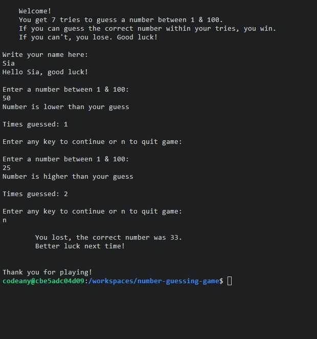
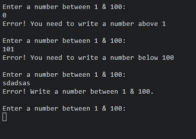
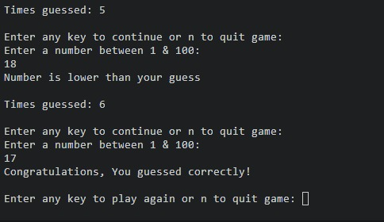

# Number Guessing Game
Number Guessing Game is a game project that randomizes a number which the player/user has to guess correctly.

[You can view this site here](https://number-guessing-game-shiaba-e2d7941e2bb0.herokuapp.com/)

## Content

### [Features](#features-1)

- [Start game](#start-game)
- [Guess number between 1-100](#guess-number-between-1-100)
- [Press any key to continue or “n” to quit](#press-any-key-to-continue-or-n-to-quit)
- [If number exceeds limit](#if-number-exceeds-limit)
- [Error warning](#error-warning)
- [Guessed number correctly](#guessed-number-correctly)
- [Features yet to add](#features-yet-to-add)
- [Flowchart](#flowchart)

### [Bug Encounters](#bug-encounters-1)
  - [Solved](#solved)
  - [Unsolved and scrapped features](#unsolved-and-scrapped-features)

### [Testing](#testing-1)
  - [Manual testing](#manual-testing)
  - [Validator testing](#validator-testing)
  - [Accessibility](#accessibility)

### [Deployment](#deployment-1)

### [Credits](#credits-1)

## Features
### Start game:
Instructions are shown and the user get the option to write their name if they wish to.  

### Guess number between 1-100:
Random generator generates numbers between 1-100 as intended at the start of the game.
- If number guess is lower than true number or
- If number guess is higher than true number:
  - When the user guesses between 1-100, the game will point out if users guess is lower or higher than the correct answer.

### Press any key to continue or “n” to quit:
After every guess, the user will be able to continue playing or deciding to quit the game

### If number exceeds limit:
Game lost:
- If the users guesses exceeds the game limit or pressing “n” to quit, the game will show what the correct number was and end the game.

### Error warning:
- If the user writes outside the value the game has, the user will get an error text that is outside the value.
- If text is written in the "Enter a number between 1 & 100" input, an Error print will appear and the user will be redirected to the input menu again without the guess counter increasing.

### Guessed number correctly:
If the users guess is correct, the game will congratulate the player and the game then ends.

### Features yet to add
- Game over screen where user can choose to either quit or continue to play.
- If user restarts the game, the name is saved until deciding to quit.

### Flowchart

Made the flowchart from [app.diagram](https://app.diagrams.net/), saved & created in device.

- [Flowchart](images/flowchart/flowchart.png)

[Back to top](#content)

## Testing
I tested the game on Microsoft edge, Chrome & Firefox. It works as intended on all these three browsers.

### Manual testing

| Feature   | Action                   | Expected Result        | Actual Result |
| ------------- | ----------------------------- | ---------------------------- | ----------------- |
| Instructions | User is given instruction | Print screen text | Works as intended |
| Input name | User is asked to write their name| Name written or not | Works as intended |
| Guess number | Number guess lower than correct number | Guess higher number  | Works as intended |
| Guess number | Number guess higher than correct number | Guess lower number | Works as intended |
| Guess number | Number below min value | Write value above min value | Works as intended |
| Guess number | Number above max value | Write value below max value | Works as intended |
| Guess number | Text is typed | Error, write number between min & max value  | Works as intended |
| Game ends | Correct value is guessed | Congratulation text shown and game ends | Works as intended |
| Game ends | Guess limit exceeds | Correct number is shown and game ends | Works as intended |
| Game ends | Type "n" to quit game | Correct number is shown and game ends | Works as intended |

### Validator testing

- Python: There was no shown bugs on either two validators that I checked the code on.

- [CI Python Linter](images/validator/pythonvalidator.png)
- [Python syntax checker](images/validator/pythonvalidator2.png)

### Accessibility
 
 [Lighthouse testing](images/lighthouse/lighthouse.png)

[Back to top](#content)

## Bug Encounters

### Solved
- On while loop when adding a number above the intended numbers (1-100), no error or warning was presented.

- I got a bug where the commands didn’t check the conditions when trying to add victory & loss if else statements to a new function or any of the other statements in function “guess_number()”. The problem got solved but the function ended up becoming very bloaty.

### Unsolved and scrapped features
- There was a bug that although the random number changes, the bug keeps saying that the correct number is X even though the correct number is Y when pressing the key to continue/restart the game. In other words, the value changes in the game but displays the same “correct” value as in the previous round.

- I scrapped Game_over function, because of a bug that showed the same answer if entered again whenever restarting the game.

[Back to top](#content)

## Deployment
- Create a new Heroku app
- Name app name & choose region
- Go to settings, add key = PORT, VALUE = 8000. Then add buildpacks(in this order):
  - heroku/python, 
  - heroku/nodejs

- On deployment method, github is chosen.
- Search repository name.

- Choose manual deploy & if wanted "Enable Automatic Deploys", which keeps the project up to date through your Github repository

Or click the deployed live project [Here](https://number-guessing-game-shiaba-e2d7941e2bb0.herokuapp.com/)

[Back to top](#content)

## Credits

- I got the max limit on guesses through video 3:20-7:55 (it was guessesTaken part): 
[Link here](https://www.youtube.com/watch?v=Jk3az4ZXEKU&list=PLA5ufyeK7gBWq_5oIuQ7Yz6FKHq5AuOEN&index=18&t=490s)

- I got the {min_value} & {max_value} from this video. Time 6:45 – 7:30: 
[Link here](https://www.youtube.com/watch?v=XlZDv2BgTk4)

- To get minimum and maximum (from site lower_bound, upper_bound) value from (“input variable name”) variable and get the value numbers to print, I checked this site:
 [Link here](https://dev.to/balapriya/how-to-code-a-simple-number-guessing-game-in-python-4jai) 

 - Code institute for deployment steps

### Code inspiration:
- I checked these pages to see the best way to add input & if/else options to a number guessing game.
 - [Link here](https://thecleverprogrammer.com/2022/06/29/number-guessing-game-using-python/)

 - [Link here](https://djangocentral.com/creating-a-guessing-game-in-python/#getting-started)

 - [Link here](https://www.linkedin.com/pulse/building-number-guessing-game-python-can-arslan)

[Back to top](#content)